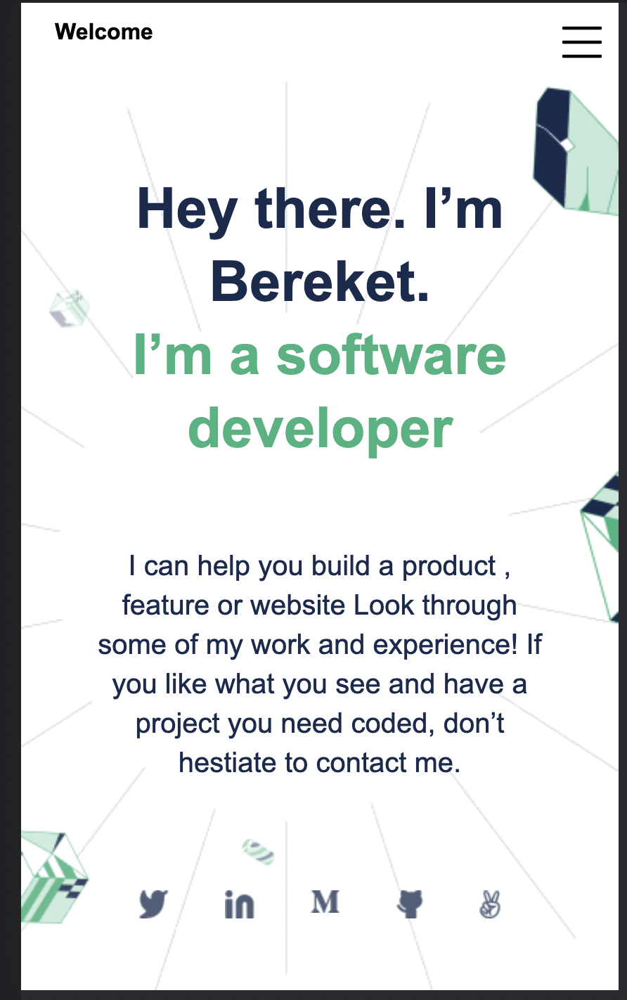

# Portfolio-Page

> This project is my portfolio page 

This project is my portfolio web page built by using html and css. This project used many web technologies. you can clone and play-around.

## Built With

- HTML
- CSS

## Live Demo

[Live Demo Link](https://bereketretta.github.io/MicroversePortfolio/)

## Getting Started

you can clone and play around :) 
git clone https://github.com/BereketRetta/MicroversePortfolio.git
cd MicroversePortfolio

## Issues

you can go to this link for issues https://github.com/BereketRetta/MicroversePortfolio/issues

## Authors

👤 **Author1**

- GitHub: [@bereketretta](https://github.com/BereketRetta)
- Twitter: [@bekiopia](https://twitter.com/bekiopia)
- LinkedIn: [Bereket-Retta](https://linkedin.com/in/bereket-retta)

## 🤝 Contributing

Contributions, issues, and feature requests are welcome!

<!-- Feel free to check the [issues page](../../issues/). -->

## Show your support

Give a ⭐️ if you like this project!

## Acknowledgments

- Microverse

## 📝 License

This project is [MIT](./MIT.md) licensed.
